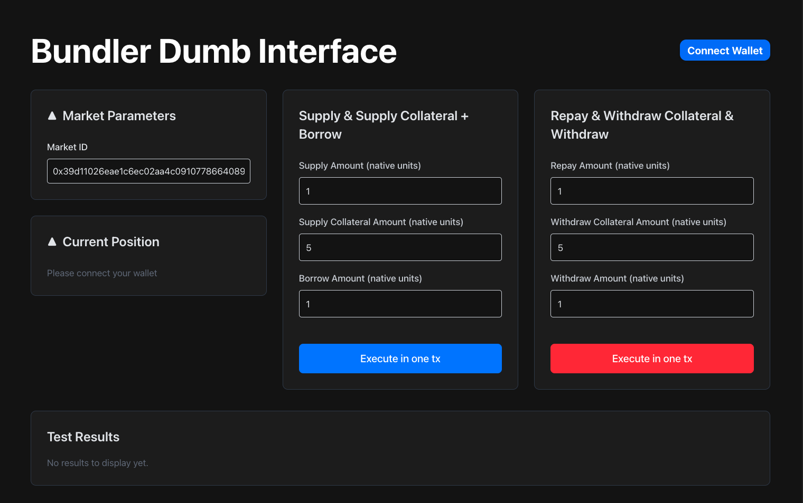

# Bundler Basic Interface

## Overview

A minimal interface for interacting with Morpho Blue's bundler functionality. This application allows users to execute complex DeFi operations in a single transaction using Morpho Blue's bundling capabilities.

The interface supports two main action bundles:

1. **Supply + Supply Collateral + Borrow**: Execute a complete lending position setup in one transaction
2. **Repay + Withdraw Collateral + Withdraw**: Close or modify positions efficiently in one transaction



## Technical Stack

### Core Libraries

- **React**: Frontend framework
- **TypeScript**: Type-safe development
- **Vite**: Build tool and development server

### Web3 Integration - @morpho-org Libraries

- **@morpho-org/blue-sdk**: Morpho Blue protocol integration
- **@morpho-org/blue-sdk-viem**: Viem-based augmentation of @morpho-org/blue-sdk that exports (and optionally injects) viem-based fetch methods.
- **@morpho-org/blue-sdk-wagmi**: Wagmi-based package that exports Wagmi (React) hooks to fetch Morpho-related entities.
- **@morpho-org/bundler-sdk-viem**: Viem-based extension of @morpho-org/simulation-sdk that exports utilities to transform simple interactions on Morpho (such as Blue_Borrow) and Morpho Vaults (such as MetaMorpho_Deposit) into the required bundles (with ERC20 approvals, transfers, etc) to submit to the bundler onchain.
- **@morpho-org/simulation-sdk**: Position simulation capabilities
- **@morpho-org/morpho-test**: Framework-agnostic extension of @morpho-org/blue-sdk that exports test fixtures useful for E2E tests on forks.
- **@morpho-org/morpho-ts**: TypeScript package to handle all things time & format-related.
- **@morpho-org/simulation-sdk**: Framework-agnostic package that defines methods to simulate interactions on Morpho (such as Supply, Borrow) and Morpho Vaults (such as Deposit, Withdraw).
- **@morpho-org/simulation-sdk-wagmi**: Wagmi-based package that exports Wagmi (React) hooks to fetch Morpho-related entities.
- **@morpho-org/test**: Test utilities for Morpho

### Web3 Integration - External Libraries

- **wagmi**: React Hooks for Ethereum
- **viem**: Low-level Ethereum interactions
- **RainbowKit**: Wallet connection interface
- **@tanstack/react-query**: Data fetching and caching

### Styling

- **Tailwind CSS**: Utility-first CSS framework

## Features

- Connect wallet using various providers (MetaMask, Rabby, OKX)
- View current market position on a given market and health metrics
- Execute bundled transactions:
  - Supply assets + Supply collateral + Borrow in one transaction
  - Repay + Withdraw collateral + Withdraw in one transaction
- Real-time position monitoring
- Support for both mainnet and local development (Anvil). Any chain can be easily added.

## Getting Started

### Prerequisites

- Node.js (v16 or higher)
- Yarn or npm
- A Web3 wallet (MetaMask, Rabby, or OKX)

### Installation

```bash
# Clone the repository
git clone [repository-url]

# Install dependencies
yarn install
# or
npm install

# Create environment file
cp .env.example.local .env.local
```

### Configuration

Update `.env.local` with your configuration:

```env
VITE_PROJECT_ID=your_wallet_connect_project_id
```

### Running the Application

```bash
# Start development server
yarn dev
# or
npm run dev
```

The application will be available at `http://localhost:5173`

### Building for Production

```bash
yarn build
# or
npm run build
```

## Usage

1. **Connect Wallet**

   - Click the "Connect Wallet" button in the top right
   - Select your preferred wallet provider

2. **View Position**

   - Current position details will display automatically
   - Monitor health factors and borrowing capacity

3. **Execute Bundled Actions**

   a. Supply + Supply Collateral + Borrow:

   - Enter the supply amount
   - Enter the collateral amount
   - Enter the borrow amount
   - Click "Execute in one tx"

   b. Repay + Withdraw Collateral + Withdraw:

   - Enter the repay amount
   - Enter the withdraw collateral amount
   - Enter the withdraw amount
   - Click "Execute in one tx"

## Development Notes

### Market IDs

The application uses Morpho Blue market IDs. The default market ID is set to a DAI market, but you can modify it for other markets.

### Simulation State

The application uses Morpho's simulation SDK to validate transactions before execution. This helps prevent failed transactions and provides accurate feedback.

### Error Handling

The interface includes comprehensive error handling for:

- Wallet connection issues
- Transaction failures
- Position health checks
- Invalid input validation

## Testing

For local testing with Anvil:

```bash
# Start local Ethereum node
anvil

# Run tests
yarn test
# or
npm test
```

## Contributing

Contributions are welcome! Please read our contributing guidelines and submit pull requests for any enhancements.

## License

This project is licensed under the MIT License - see the LICENSE file for details.
